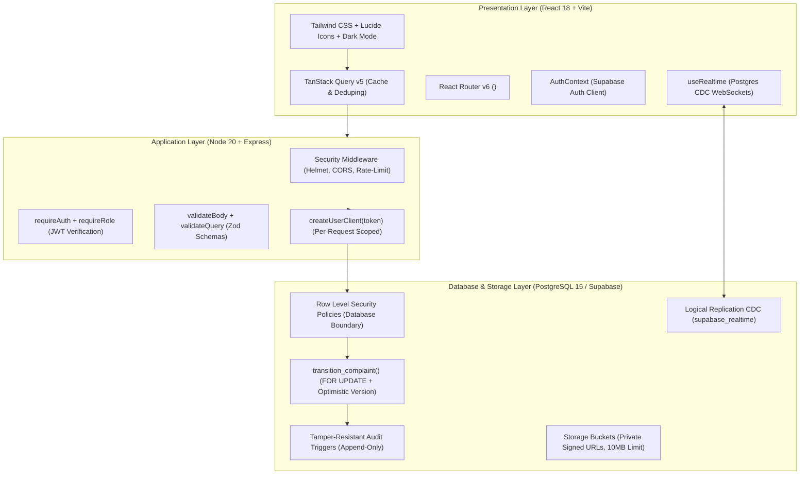

# ComplaintEase Enterprise

[](https://www.typescriptlang.org/)
[](https://react.dev/)
[](https://nodejs.org/)
[](https://supabase.com/)
[]()
[]()

**ComplaintEase Enterprise** is an incident reporting, plant operations, and complaint resolution platform built as an isolated TypeScript monorepo. It couples an authenticated React 18 client with a stateless Express API and a hardened PostgreSQL 15 / Supabase database.

The system is designed around **defense-in-depth authorization**, **hybrid concurrency locking**, **kernel-level audit tamper resistance**, and **sub-millisecond keyset pagination**.

---

## 1. High-Level Architecture & Tech Stack



| Layer | Technology | Key Responsibility |
|---|---|---|
| **Frontend** | React 18, Vite, TypeScript, Tailwind CSS, TanStack Query, React Hook Form | Single Page Application with dual-portal authentication, live GPS incident mapping, and realtime CDC synchronization |
| **Backend** | Node 20, Express, TypeScript, Zod, Pino, Helmet, express-rate-limit | Stateless REST API validating request contracts, rate-limiting IPs, and issuing user-scoped database clients |
| **Database** | PostgreSQL 15, Supabase Auth (GoTrue), Supabase Storage | 3NF relational schema, Row Level Security (RLS), atomic stored procedures, and append-only audit triggers |
| **Shared** | `@complaintease/shared` | Monorepo package sharing Zod schemas and TypeScript interfaces across client and server |
| **Testing** | Vitest, Supertest, V8 Coverage | Unit tests for state machine, schema validators, role guards, API integration, and security regressions |

---

## 2. Core Engineering Capabilities

1. **Defense-in-Depth Authorization Model:**
   - Express route guards (`requireRole`) provide fast HTTP 403 responses at the perimeter.
   - PostgreSQL Row Level Security (RLS) provides the database-level authorization boundary. Queries execute via per-request clients (`createUserClient(jwt)`) injecting `auth.uid()`, preventing unauthorized row access even if API filters are bypassed.
2. **Hybrid Concurrency Control (`transition_complaint`):**
   - Solves the lost-update anomaly by combining **pessimistic row locking** (`SELECT ... FOR UPDATE`) with **optimistic version checking** (`expected_version`).
   - If two operators transition a ticket simultaneously, concurrent transactions queue at the row lock; stale updates are rejected with SQLSTATE `P0003` (HTTP 409 Conflict).
3. **Deterministic Finite State Machine (FSM):**
   - Direct status updates via `UPDATE complaints SET status = ...` are blocked by a database trigger (`trg_block_direct_status_update`). Status changes must execute through `transition_complaint()`.
4. **Tamper-Resistant Audit Trail:**
   - Database mutations on audited tables trigger JSON diff captures. A `BEFORE UPDATE OR DELETE` trigger aborts any attempt to modify or delete historical records (SQLSTATE `55000`).
5. **Deterministic Keyset Pagination:**
   - Implements `(created_at, id)` composite cursor seeking over composite B-tree indexes, ensuring consistent $O(\log N)$ retrieval time regardless of dataset size.
6. **Live Multi-Dashboard Realtime Synchronization:**
   - Supabase Realtime listens to PostgreSQL Write-Ahead Log (WAL) events and broadcasts CDC updates over WebSockets, invalidating TanStack Query caches across employee and administrator dashboards.
7. **Incident Telemetry & Photographic Evidence:**
   - Employees file complaints with HTML5 GPS coordinates and photographic evidence. Images are validated and stored via private Supabase Storage signed URLs.

---

## 3. Monorepo Structure

```
complaintease/
├── apps/
│   ├── web/                    # React 18 + Vite frontend SPA
│   │   ├── src/
│   │   │   ├── components/     # UI components, badges, modals, Layout, VirtualList
│   │   │   ├── context/        # AuthContext, ThemeContext (Dark/Light mode)
│   │   │   ├── hooks/          # useRealtime WebSocket hook
│   │   │   ├── lib/            # api-client.ts, supabase.ts
│   │   │   └── pages/          # Login, EmployeeDashboard, NewComplaint, AdminPanel, ComplaintDetail
│   │   └── package.json
│   └── api/                    # Express + Node 20 backend API
│       ├── src/
│       │   ├── middleware/     # requireAuth, requireRole, validate, errorHandler, rateLimit
│       │   ├── routes/         # auth, complaints, comments, attachments, notifications, admin, health
│       │   ├── scripts/        # seed-users.ts
│       │   ├── test/           # 38 Vitest test suites (state-machine, validators, security-fixes, etc.)
│       │   └── utils/          # supabase.ts (user RLS client & admin client), logger.ts (Pino)
│       └── Dockerfile          # Multi-stage production container build
├── packages/
│   └── shared/                 # Shared TypeScript models and Zod validation schemas
│       ├── src/types/          # enums.ts, complaint.ts, user.ts, department.ts, category.ts
│       └── src/schemas/        # complaint.schema.ts, auth.schema.ts, transition.schema.ts
├── supabase/
│   ├── migrations/             # 9 immutable SQL migrations (001 to 009)
│   ├── seed.sql                # Relational seed data and 10,000-row synthetic benchmark generator
│   └── tests/                  # pgTAP / SQL verification scripts
└── docs/                       # Comprehensive architecture, security, and interview documentation
    ├── ARCHITECTURE.md         # Detailed request flow and component diagrams
    ├── STATE_MACHINE.md        # FSM lifecycle rules, transitions, and lock mechanics
    ├── RLS_MATRIX.md           # Granular Role × Table × Operation permission matrix
    ├── DECISIONS.md            # Architectural Decision Records (ADRs 1–8)
    ├── ERD.md                  # 3NF Entity Relationship Diagram and index selection rationale
    ├── PERFORMANCE.md          # Query optimization plans and bundle metrics
    ├── INTERVIEW_QA.md         # 40 technical interview defense questions & answers
    ├── WALKTHROUGH.md          # Pedagogical file-by-file code walkthrough
    ├── DEPLOY.md               # Step-by-step production deployment guide
    └── PROJECT_FREEZE_AUDIT.md # Complete audit verification report and freeze dossier
```

---

## 4. Quick Start (Local Development)

### Prerequisites
- Node.js `>= 20.0.0`
- pnpm `>= 8.0.0`
- A free [Supabase](https://supabase.com) project (for PostgreSQL, Auth, and Storage)

### Setup Steps

```bash
# 1. Clone the repository
git clone https://github.com/gsiddharthrao/ComplaintEase-Enterprise-.git
cd ComplaintEase-Enterprise-

# 2. Install workspace dependencies
pnpm install

# 3. Configure environment files
cp apps/web/.env.example apps/web/.env.local
cp apps/api/.env.example apps/api/.env
# Edit both files with your Supabase Project URL and API keys

# 4. Apply database migrations to Supabase
# Paste supabase/migrations/001_extensions_and_enums.sql through 009 in the Supabase SQL Editor
# Then run supabase/seed.sql to populate departments and categories

# 5. Provision the initial Administrator account
pnpm --filter @complaintease/api seed

# 6. Start development servers in parallel
pnpm dev
```

- Frontend SPA: `http://localhost:5173`
- Backend API: `http://localhost:3000`
- Health Probe: `http://localhost:3000/health`

---

## 5. Verification & Test Suite

The codebase is strictly typed and verified:

```bash
# Strict TypeScript compilation across all 3 workspaces
pnpm -r typecheck
# Result: 0 errors, 0 warnings

# Automated test execution (38 passing tests across 5 suites)
pnpm -r test
# Result:
# ✓ src/test/state-machine.test.ts (6 tests)
# ✓ src/test/validators.test.ts (13 tests)
# ✓ src/test/security-fixes.test.ts (10 tests)
# ✓ src/test/role-permissions.test.ts (5 tests)
# ✓ src/test/api-endpoints.test.ts (4 tests)

# Production bundling
pnpm -r build
# Result: ESM + CJS + DTS bundle (@complaintease/shared), tsc (@complaintease/api), Vite production bundle (@complaintease/web)
```

---

## 6. User Roles & Account Provisioning

ComplaintEase operates on a 2-role security model:

| Role | Access Scope | Provisioning Method |
|---|---|---|
| **`employee`** | Can file incidents, attach GPS telemetry and photos, view own tickets, add comments, and reopen resolved complaints | Self-registration via the Staff Portal tab (`/login?portal=staff&mode=register`) |
| **`admin`** | Command center access to all department incidents, 1-click specialist assignment, lifecycle transitions, department/category management, role modification, and tamper-resistant audit logs | Initial provisioning via `pnpm seed` or administrative role assignment |

---

## 7. Known Operational Characteristics

1. **Free-Tier Supabase Pausing:** Inactive Supabase projects sleep after periods of dormancy; the initial request may observe cold-start connection latency.
2. **Browser Geolocation Approval:** Live GPS telemetry relies on browser Web API permissions; if a user denies location access, the form cleanly falls back to manual physical landmark/room descriptions.
3. **Storage Quotas:** File uploads are limited to 10 MB per file with whitelisted MIME types enforced at both the API and database levels.

---

## 8. Documentation Index

For in-depth architectural and interview defense material, explore the `docs/` directory:

- [System Architecture](docs/ARCHITECTURE.md)
- [Complaint Lifecycle State Machine](docs/STATE_MACHINE.md)
- [Row Level Security Matrix](docs/RLS_MATRIX.md)
- [Entity Relationship Diagram & Indexes](docs/ERD.md)
- [Architectural Decision Records (ADRs)](docs/DECISIONS.md)
- [Performance Benchmarking & Profiling](docs/PERFORMANCE.md)
- [Technical Interview Q&A (40 Questions)](docs/INTERVIEW_QA.md)
- [Pedagogical Code Walkthrough](docs/WALKTHROUGH.md)
- [Deployment Guide](docs/DEPLOY.md)
- [Project Freeze Audit & Release Dossier](docs/PROJECT_FREEZE_AUDIT.md)
