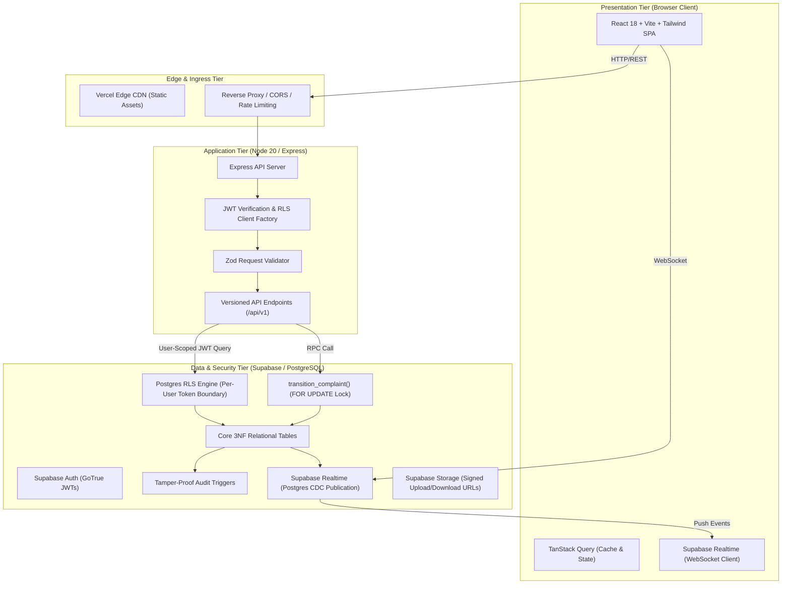
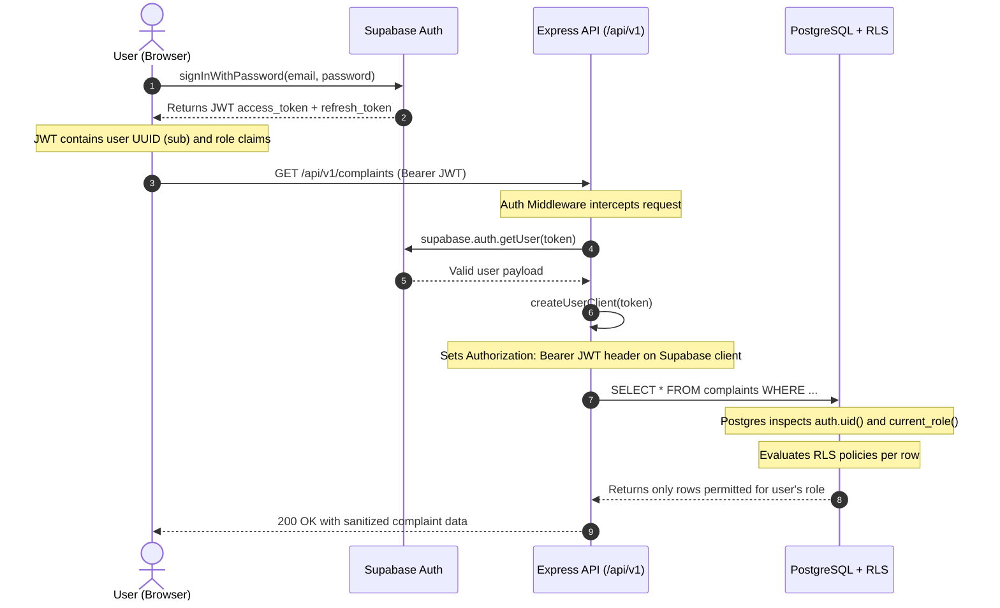

# ComplaintEase System Architecture

ComplaintEase is an enterprise-grade complaint and incident tracking system designed with **defense-in-depth security**, **high concurrency isolation**, and **sub-millisecond indexed data retrieval**.

---

## 1. High-Level Architecture Diagram

---

## 2. Authentication & Authorization Flow

---

## 3. Defense-in-Depth Security Strategy

ComplaintEase implements a multi-layer security perimeter:

1. **Network & Ingress Defense:**
   - **Helmet:** Adds secure HTTP headers (`Strict-Transport-Security`, `X-Content-Type-Options`, `Content-Security-Policy`).
   - **CORS Allowlist:** Strictly checks incoming `Origin` against production domain allowlists.
   - **Rate Limiting:** `express-rate-limit` throttles IP-based bursts to prevent brute-force authentication and denial of service.

2. **Application Boundary Defense:**
   - **Zod Validation:** Enforces strict structural schema constraints before business logic runs.
   - **Per-Request User Client:** The API **never** passes user queries through the database `service_role` superuser key. Every database call inherits the user's personal JWT token.

3. **Database Kernel Defense (RLS & Triggers):**
   - **Row Level Security:** Even if an API developer writes `SELECT * FROM complaints` with no WHERE clause, PostgreSQL evaluates RLS policies and hides rows outside the caller's authorized department or ownership.
   - **Tamper-Proof Triggers:** Direct SQL `UPDATE complaints SET status = ...` is trapped and aborted by a BEFORE UPDATE trigger. All transitions must invoke `transition_complaint()`.

---

## 4. Realtime Streaming Architecture

When a complaint status changes or an assignment is created:
1. `transition_complaint()` updates the `complaints` row and inserts a `status_history` record within an atomic ACID transaction.
2. The trigger `trg_notify_status_change` automatically inserts an in-app notification for the author.
3. PostgreSQL Logical Replication streams the CDC (Change Data Capture) event through the `supabase_realtime` publication.
4. The client's active WebSocket connection receives the broadcast and calls `queryClient.invalidateQueries()`, triggering immediate optimistic cache updates without full page refreshes.
