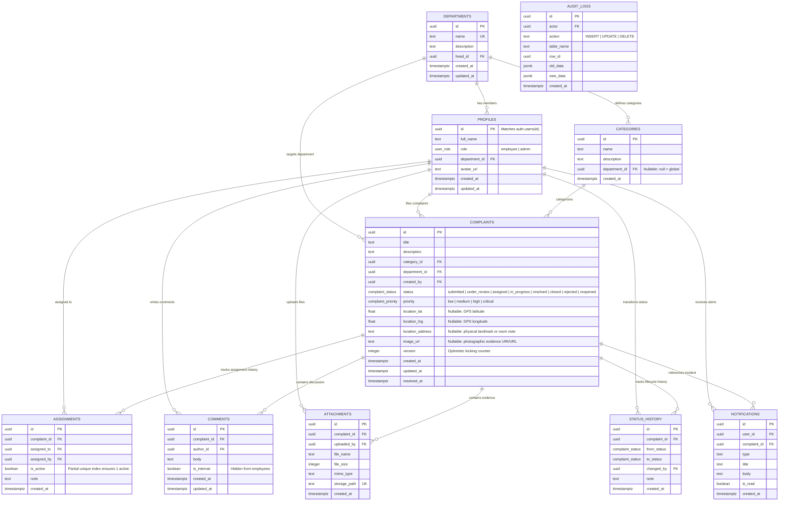

# Entity Relationship Diagram (ERD) & Index Rationale

The ComplaintEase schema is normalized to **Third Normal Form (3NF)**:
1. Every column contains atomic values (1NF).
2. All non-key attributes are fully functionally dependent on the primary key (2NF).
3. No transitive dependencies exist between non-key attributes (3NF).

---

## 1. Mermaid Entity-Relationship Diagram

---

## 2. Table Rationale (One-Line Reasons)

| Table | Architectural Purpose |
|---|---|
| `departments` | Models enterprise divisions and routes complaints to responsible managerial staff. |
| `profiles` | Extends Supabase `auth.users` with application roles, department bindings, and full names. |
| `categories` | Classifies complaints under specific operational topics (both global and department-specific). |
| `complaints` | Core domain entity recording the incident, lifecycle state, priority, and optimistic lock version. |
| `assignments` | Maintains full assignment history while enforcing that exactly one specialist is actively assigned. |
| `comments` | Threaded incident communication supporting public notes and staff-only internal discussions. |
| `attachments` | Links files stored in Supabase Storage buckets to specific complaints with access controls. |
| `status_history` | Append-only audit timeline recording every lifecycle state transition and author reasoning. |
| `audit_logs` | Tamper-resistant, append-only trigger log capturing row-level mutation diffs for compliance. |
| `notifications` | Asynchronous in-app user notifications delivered via Supabase Realtime WebSocket events. |

---

## 3. Composite Index Design & Selection Rationale

Indexes were not created randomly; each serves an exact application query pattern:

| Index Name | Table & Columns | Target Query & Performance Rationale |
|---|---|---|
| `idx_complaints_dept_status_created` | `complaints (department_id, status, created_at DESC)` | **Department Triage Query:** Eliminates table scan and sort node by indexing equality filters (`department_id`, `status`) followed by the sorting column (`created_at DESC`). |
| `idx_complaints_created_by_created` | `complaints (created_by, created_at DESC)` | **Employee Dashboard Query:** Directly scans an employee's complaints in reverse chronological order with zero memory sort. |
| `idx_complaints_status_priority` | `complaints (status, priority)` | **Admin Overview & Triage Filter:** Quickly filters high/critical complaints across active statuses. |
| `idx_complaints_search` | `complaints USING gin ((title \|\| ' ' \|\| description) gin_trgm_ops)` | **Global Full-Text Search:** GIN Trigram index accelerates fuzzy substring matching (`ILIKE '%outage%'`) over large dataset sizes. |
| `idx_assignments_assigned_status` | `assignments (assigned_to, is_active) WHERE is_active = true` | **Specialist Task Query:** Partial index drastically reduces index size by only indexing active ticket assignments. |
| `idx_comments_complaint_created` | `comments (complaint_id, created_at ASC)` | **Complaint Thread Query:** Fetches chronologically ordered discussion without in-memory sorting. |
| `idx_status_history_complaint_created` | `status_history (complaint_id, created_at ASC)` | **Timeline Render Query:** Rapidly streams chronological history events for complaint detail pages. |
| `idx_notifications_user_unread` | `notifications (user_id, is_read, created_at DESC) WHERE is_read = false` | **Navbar Badge Query:** Partial index serves unread alerts in sub-millisecond time. |
| `idx_audit_logs_table_row` | `audit_logs (table_name, row_id, created_at DESC)` | **Incident Forensic Query:** Fetches the complete mutation history of any specific entity. |
| `idx_audit_logs_actor_created` | `audit_logs (actor, created_at DESC)` | **User Action Audit:** Inspects recent administrative operations performed by a given user. |
| `idx_complaints_location` | `complaints (location_lat, location_lng) WHERE location_lat IS NOT NULL` | **Spatial Geotag Feed Query:** Accelerates geographic queries and map bounds lookups for geotagged plant incidents. |
