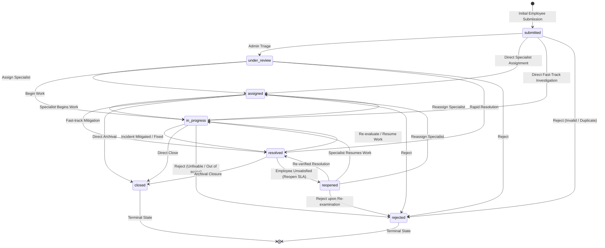

# Complaint Lifecycle State Machine

ComplaintEase models complaints as a deterministic **Finite State Machine (FSM)**.
Status cannot be updated directly through raw SQL `UPDATE` statements; it is strictly governed through the transactional database function `transition_complaint()`.

---

## 1. State Machine Diagram



---

## 2. Transition Rules Matrix (`ALLOWED_TRANSITIONS`)

The transitions configured in `packages/shared/src/types/enums.ts` and validated by the backend service are defined as follows:

| Current Status (`from_status`) | Allowed Target Statuses (`to_status`) | Permitted Roles | Operational Rationale |
|---|---|---|---|
| `submitted` | `under_review`, `assigned`, `in_progress`, `rejected` | `admin` | Triage, direct specialist assignment, or immediate rejection for spam/duplicate filings. |
| `under_review` | `assigned`, `in_progress`, `resolved`, `rejected` | `admin` | Routing to assigned worker, direct investigation, or rapid dismissal. |
| `assigned` | `in_progress`, `resolved`, `closed`, `rejected` | `admin` | Investigation commencement, immediate sign-off, or closure. |
| `in_progress` | `resolved`, `assigned`, `closed`, `rejected` | `admin` | Remediation completion (sets `resolved_at = now()`), worker reassignment, or rejection. |
| `resolved` | `closed`, `reopened`, `in_progress` | `admin`, **`employee`** (reopen only) | Creator empowerment to reopen if unsatisfied with the fix; admin closure or resume. |
| `reopened` | `in_progress`, `assigned`, `resolved`, `rejected` | `admin` | Secondary triage and re-assignment to active remediation. |
| `closed` | *(none)* | *(none)* | **Terminal State:** Read-only historical record; immutable. |
| `rejected` | *(none)* | *(none)* | **Terminal State:** Archival state for invalid or unserviceable complaints. |

---

## 3. Concurrency & Locking Mechanics

### Concurrency Challenges in Ticket Lifecycles
In high-throughput operational systems, multiple staff members or automated processes may attempt to act on the same incident ticket concurrently.
Without transactional locking and version verification, concurrent requests can lead to lost updates or illegal state transitions (e.g. attempting to resolve an already-closed or rejected incident).

### Hybrid Pessimistic / Optimistic Concurrency Control
ComplaintEase implements a hybrid concurrency control model at the PostgreSQL layer within `transition_complaint()`:

```sql
-- 1. Row-Level Exclusive Lock (Pessimistic)
SELECT * INTO v_complaint
FROM complaints
WHERE id = p_complaint_id
FOR UPDATE;

-- 2. Version Verification (Optimistic)
IF v_complaint.version != p_expected_version THEN
  RAISE EXCEPTION 'Conflict: expected version %, but current version is %',
    p_expected_version, v_complaint.version
    USING ERRCODE = 'P0003';
END IF;
```

### Architectural Guarantees & Flow:
1. **Pessimistic Row-Level Lock (`FOR UPDATE`):**
   - Serializes concurrent transactions targeting the same complaint row.
   - Prevents race conditions during state evaluation and history appending within PostgreSQL.
2. **Optimistic Version Check (`version = p_expected_version`):**
   - Confirms that the record has not mutated between read and commit phases.
   - If a conflict occurs, the database transaction aborts cleanly with SQLSTATE `P0003`, returning an HTTP `409 Conflict` error to the API client.
3. **Atomic State Mutation:**
   - On successful validation, `status` is updated, `version` is incremented (`version = version + 1`), and a corresponding entry is inserted into `status_history` in a single atomic transaction.
4. **Trigger-Guarded Immutability:**
   - The `trg_block_direct_status_update` trigger blocks standard SQL `UPDATE complaints SET status = ...` queries unless executed within the authorized transition context.
