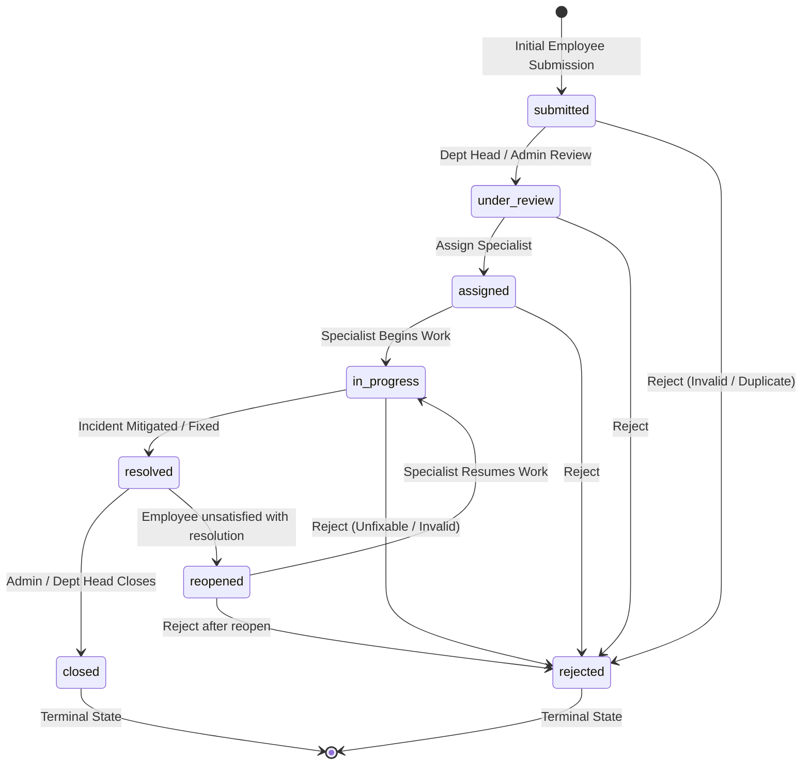

# Complaint Lifecycle State Machine

ComplaintEase models complaints as a deterministic **Finite State Machine (FSM)**.
Status cannot be updated directly through SQL UPDATE statements; it must transition through the transactional database function `transition_complaint()`.

---

## 1. State Machine Diagram



---

## 2. Allowed Transition Rules (`allowed_transitions` Table)

| Current Status (`from_status`) | Allowed Next Status (`to_status`) | Permitted Roles | Business Rationale |
|---|---|---|---|
| `submitted` | `under_review` | `dept_head`, `admin` | Department manager begins initial triage. |
| `submitted` | `rejected` | `dept_head`, `admin` | Immediate rejection for spam, duplicate, or irrelevant filings. |
| `under_review` | `assigned` | `dept_head`, `admin` | Manager routes incident to a designated specialist. |
| `under_review` | `rejected` | `dept_head`, `admin` | Rejected after preliminary department evaluation. |
| `assigned` | `in_progress` | `dept_head`, `admin` | Assigned engineer or specialist starts active investigation. |
| `assigned` | `rejected` | `dept_head`, `admin` | Specialist verifies ticket is out of scope or invalid. |
| `in_progress` | `resolved` | `dept_head`, `admin` | Remediation completed; sets `resolved_at = now()`. |
| `in_progress` | `rejected` | `dept_head`, `admin` | Unresolvable constraint or policy violation identified. |
| `resolved` | `closed` | `dept_head`, `admin` | Archival closure after satisfactory grace period. |
| `resolved` | `reopened` | **`employee`**, `admin` | **Employee empowerment:** Creator can reopen within SLA if issue persists. Clears `resolved_at`. |
| `reopened` | `in_progress` | `dept_head`, `admin` | Specialist resumes remediation work. |
| `reopened` | `rejected` | `dept_head`, `admin` | Issue confirmed resolved or rejected upon re-examination. |
| `closed` | *(none)* | *(none)* | **Terminal State:** No further state transitions allowed. |
| `rejected` | *(none)* | *(none)* | **Terminal State:** Permanently archived as rejected. |

---

## 3. Concurrency & Optimistic Locking (`version` Column)

### The Lost-Update Problem in Distributed Systems
Imagine two department heads viewing the same complaint at `version = 3`:
1. **User A** decides to transition status to `in_progress`.
2. Simultaneously, **User B** decides to `reject` the complaint.
3. Without concurrency control, User B's change could silently overwrite User A's work without User B ever realizing the status was progressed.

### The ComplaintEase Solution: Pessimistic Lock + Optimistic Version Check
Within `transition_complaint()`:
```sql
-- 1. Row-level exclusive lock (Pessimistic)
SELECT * INTO v_complaint
FROM complaints
WHERE id = p_complaint_id
FOR UPDATE;

-- 2. Version check (Optimistic)
IF v_complaint.version != p_expected_version THEN
  RAISE EXCEPTION 'Conflict: expected version %, but current version is %',
    p_expected_version, v_complaint.version
    USING ERRCODE = 'P0003';
END IF;
```

1. **`FOR UPDATE`** locks the specific row in the database buffer, forcing concurrent transactions on that ID to queue rather than run simultaneously.
2. The **`p_expected_version`** parameter verifies that the row hasn't changed since the client fetched it.
3. If versions do not match, the transaction rolls back immediately with SQLSTATE `P0003`, and the API returns HTTP `409 Conflict`.
4. If versions match, the row is updated, `version = version + 1` is applied, and `status_history` is appended atomically.

