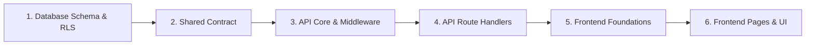

# File-by-File Code Walkthrough & Reading Guide

This walkthrough guides you through the ComplaintEase codebase in logical pedagogical order, explaining the purpose, key functions, and mechanics of every critical file.

---

## Recommended Reading Order

---

## 1. Database Migrations (`/supabase/migrations`)

### `001_extensions_and_enums.sql`
- **Purpose:** Foundation migration.
- **Key Concepts:**
  - `CREATE EXTENSION pgcrypto`: Provides `gen_random_uuid()` for generating collision-resistant primary keys.
  - `CREATE EXTENSION pg_trgm`: Enables trigram-based string similarity indexing.
  - Custom Enums: `user_role` (`employee`, `admin`), `complaint_status`, and `complaint_priority`.

### `002_core_tables.sql`
- **Purpose:** Normalized 3NF tables with strict relational integrity constraints.
- **Key Concepts:**
  - `departments`: Enterprise divisions.
  - `profiles`: 1:1 extension of Supabase's `auth.users` with cascading deletion.
  - `complaints`: Core business entity with `version` integer for optimistic locking.
  - `assignments`: Tracks assignment history; features a partial unique index `idx_assignments_one_active` ensuring only one active assignee per ticket.
  - `comments`: Supports public discussion and staff-only internal notes (`is_internal = true`).
  - `audit_logs`: Audit trail table capturing JSON diffs.

### `003_indexes.sql`
- **Purpose:** Performance indexes designed for real queries.
- **Key Concepts:**
  - `idx_complaints_dept_status_created`: Composite index on `(department_id, status, created_at DESC)` for department triage queries.
  - `idx_complaints_created_by_created`: Composite index on `(created_by, created_at DESC)` for employee queries.
  - `idx_complaints_trgm_search`: GIN trigram index on `(title || ' ' || description)` for fast full-text substring search.

### `004_functions.sql`
- **Purpose:** Core business logic and transition state machine.
- **Key Concepts:**
  - `current_user_role()` & `current_user_dept()`: `SECURITY DEFINER` helpers that avoid RLS recursion loops.
  - `allowed_transitions`: Master lookup table of valid lifecycle pairs.
  - `transition_complaint()`: Atomic function that executes `SELECT ... FOR UPDATE` (pessimistic lock), checks `expected_version` (optimistic lock), validates the transition against `allowed_transitions`, verifies the caller's role, updates status, and appends to `status_history`.
  - `enforce_status_via_function()`: Trigger function that raises SQLSTATE `P0005` on direct status updates.

### `005_audit_triggers.sql`
- **Purpose:** Append-only audit trail and updated-at timestamps.
- **Key Concepts:**
  - `process_audit_log()`: Trigger function that writes JSONB diffs of `OLD` and `NEW` records to `audit_logs`.
  - `block_audit_log_modification()`: BEFORE UPDATE/DELETE trigger that raises SQLSTATE `55000` to prevent tampering with audit logs.

### `006_rls.sql`
- **Purpose:** Row Level Security policies for all tables.
- **Key Concepts:**
  - Granular `SELECT`, `INSERT`, `UPDATE`, and `DELETE` policies for `employee` and `admin`.
  - Hides internal comments from employees (`is_internal = false`).
  - Restricts employees to their own complaints (`created_by = auth.uid()`), while granting admins global management capability.

---

## 2. Shared Types & Schemas (`/packages/shared`)

### `src/types/enums.ts`
- Defines TypeScript union types matching PostgreSQL enums (`UserRole`, `ComplaintStatus`, `ComplaintPriority`).
- Exports `ALLOWED_TRANSITIONS` and `TRANSITION_PERMISSIONS` mappings.

### `src/types/complaint.ts`, `user.ts`, `comment.ts`
- Strong TypeScript interfaces mirroring database rows and API responses (`Complaint`, `ComplaintWithRelations`, `Profile`).

### `src/schemas/complaint.schema.ts`, `auth.schema.ts`, `transition.schema.ts`
- Zod schemas that validate data structures on both frontend and backend.

---

## 3. Backend API (`/apps/api`)

### `src/config/env.ts`
- Validates environment variables (`PORT`, `SUPABASE_URL`, `SUPABASE_ANON_KEY`, `SUPABASE_SERVICE_ROLE_KEY`) on server startup using Zod.

### `src/utils/supabase.ts`
- `createUserClient(token)`: Instantiates a per-request Supabase client with the user's Bearer token so PostgreSQL receives the user identity and evaluates RLS.
- `getAdminClient()`: Service role client restricted to seed scripts and user provisioning.

### `src/middleware/auth.ts`
- `requireAuth`: Verifies the incoming Bearer token, checks authentication with Supabase Auth, and attaches `req.supabase`, `req.user`, and `req.profile` to the Express Request.
- `requireRole(allowedRoles)`: Rejects requests with HTTP 403 if the user does not have an allowed role.

### `src/middleware/error-handler.ts`
- Centralized error handler that maps PostgreSQL error codes (`P0001`, `P0003`, `P0005`, `42501`, `55000`) to standardized HTTP JSON responses with request IDs.

### `src/routes/complaints.ts`
- `GET /complaints`: Implements keyset pagination (`created_at__id`) and PostgREST embedded joins to fetch complaints without N+1 queries.
- `POST /complaints/:id/transition`: Invokes the database function `transition_complaint()`.
- `POST /complaints/:id/assign`: Assigns a specialist and updates status.

---

## 4. Frontend Application (`/apps/web`)

### `src/lib/supabase.ts` & `src/lib/api-client.ts`
- Browser Supabase client and typed HTTP fetch wrapper that automatically attaches the user's JWT token to outgoing requests.

### `src/context/AuthContext.tsx`
- Manages user session state, handles login/logout, and listens to Supabase auth events via `onAuthStateChange`.

### `src/hooks/useRealtime.ts`
- Sets up Supabase Realtime WebSocket subscriptions on `complaints`, `comments`, and `notifications`, automatically invalidating TanStack Query caches on changes.

### `src/components/auth/ProtectedRoute.tsx`
- Route wrapper that verifies authentication and role permissions before rendering protected pages.

### `src/pages/ComplaintDetail.tsx`
- Renders the complaint header, lifecycle state machine transition actions, assignee modal, and tabbed panels for Timeline, Comments Thread, and File Attachments.

### `src/components/common/VirtualList.tsx`
- Custom virtualized windowing component that renders only visible list items, ensuring smooth scrolling over large datasets.

